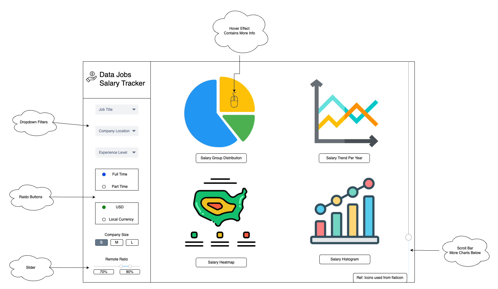

# Data Science Job Compensation Dashboard

Our role: MDS Career Advising Assistant

Target audience: MDS Students

As the Master of Data Science program approaches the end, we understand the immense stress students might feel exploring career opportunities while juggling academic challenges. Career exploration is a critical component of our life journey, yet the scope can be vast, making it overwhelming and time-consuming for many of us. If we could understand the variability in compensation levels across different geographical locations and the character of companies, we could unload one of the criteria students have to explore- salary. We propose building a dashboard where students can explore different factors impacting the salary they expect to receive. We aim that our tool can serve as an initial exploration tool to narrow their job search effort based on the kind of lifestyle and compensation levels students wish to achieve. Our dashboard will display the distribution of income by region, type of roles around data (data scientist, data analyst, ML engineer, Data engineer etc.), the size of the company, the industry the company is in, and the intersections of two factors for students to filter and compare.

## Description of the data

The dataset we are going to be visualizing includes 607 jobs in the field of data science. Each job has seven key variables that contain detailed information about the position, employer, and compensation. We assume this information could help MDS graduate students explore the job markets and narrow their job search efforts. These variables include:

- Level of experience of the role (`experience_level` e.g. Entry level(EN), Mid-Level(ML), Senior(SE), Experience(EX))
- Type of employment (`employment_type` e.g. Full Time(FT), Part Time(PT), Contract(CT), Freelance(FL))
- Specific position or role within the data science field (`job_title`, e.g. Data Scientist, Data Analyst, etc)
- Salaries measured in USD (`salary_in_usd`)
- Geographical locations of the company recorded in country code (`company_location`)
- Size of the employing company (`company_size` e.g. Large(L), Median(M), Small(S))

We will also derive a new variable (`work_arrangement`) from the existing variable (`remote_ratio`) to explore whether the position is remote (`remote_ratio` = 100), hybrid (0 < `remote_ratio` < 100), or onsite (`remote_ratio` = 0). Given that students might have varied preferences regarding work arrangements, this new variable could be beneficial for them to explore job opportunities based on their preferred work styles.

## Research Question & Scenario Example

With the Data Science Job Compensation Dashboard, MDS students have another useful tool to navigate job application challenges. By providing access to world wide data on compensation, company types, and job roles, our dashboard allows students to investigate research questions they may have on the industry that will aid them in finding the best role suited for their goals.

To illustrate, let's explore a practical example of how this tool can be useful for a hypothetical MDS graduate named Joel. Joel's story will highlight the dashboard's functionality and its value in making informed decisions about his future in the data science field.

Joel, an MDS graduate specializing in data visualization, uses the Data Science Job Compensation Dashboard to guide his job search. He starts by [comparing] salaries across different cities, using the dashboard to [visualize] compensation trends worldwide. Interested in tech and finance sectors, Joel [filters] job roles to Data Analyst and Visualization Specialist, paying close attention to industries with competitive pay.

He then explores how company size affects salaries and job satisfaction, discovering that mid-sized tech firms offer the balance he seeks between compensation and a collaborative environment. The Skills and Technologies section indicates he might be served improving a high in demand skill with high paying data science jobs, prompting him to consider an extra advanced machine learning course to boost his profile.

With these new insights, Joel focuses his applications on mid-sized companies in cities where the salary supports a high quality of life. This targeted approach, informed by the dashboard, enables Joel to navigate the job market strategically, aligning his career aspirations with market realities.

## App Sketch & Description

This one-page app contains information to help graduates with the data job salary before landing. Four distributions will be shown on the main panel, each containing the salary combined with a few interesting factors(i.e. experience level, employment type, employee residence, company size). There will be some filters on the side panel. There should be dropdown filters for job titles, company levels, and experience levels; radio buttons for currency and employment types; and sliders for any time data. Users can interact with the distributions with the help of these filters.